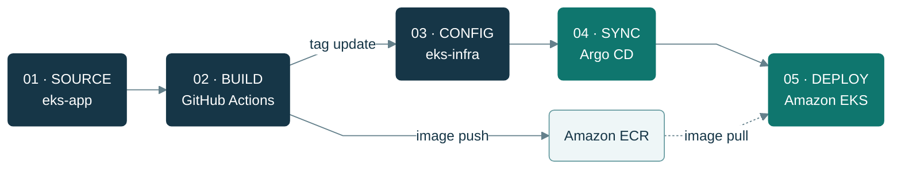
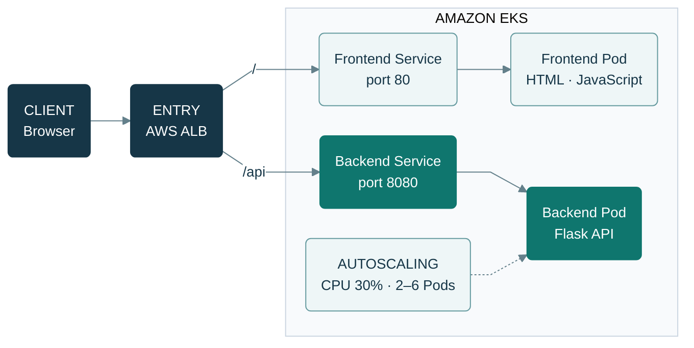
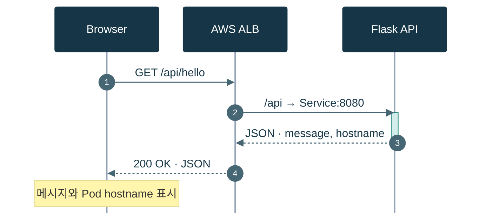

# EKS 개인 프로젝트

AWS EKS 기반 컨테이너 오케스트레이션 실습 프로젝트.
GitHub Actions + Argo CD CI/CD 파이프라인, Prometheus + Grafana 모니터링, HPA 오토스케일링 구성.

---

## 연관 Repository

| 구분 | Repository | 설명 |
|---|---|---|
| 개발자용 | `eks-app` | 프론트엔드 + 백엔드 소스코드, Dockerfile |
| 엔지니어용 | `eks-infra` (이 repo) | Terraform, K8s 매니페스트, Argo CD, 모니터링 |

---

## 아키텍처

### CI/CD 배포 흐름



CI는 이미지를 ECR에 올린 뒤 `eks-infra`의 이미지 태그를 갱신합니다. Argo CD는 `k8s/overlays/dev` 변경을 감지해 자동 동기화합니다.

### 서비스 요청 흐름



Ingress는 `/`를 프론트엔드로, `/api`를 백엔드로 라우팅합니다. HPA는 백엔드 Deployment를 대상으로 CPU 사용률에 따라 Pod 수를 조절합니다.

### 백엔드 API 호출 순서



- `GET /api/health`: 상태 확인 (`status: ok`)
- `GET /api/hello`: 메시지와 요청을 처리한 Pod의 hostname 반환

현재 백엔드는 데모 API이며 데이터베이스 연결은 없습니다. 위 다이어그램은 저장소의 코드와 매니페스트를 기준으로 작성했습니다.

---

## 폴더 구조

```
02_EKS_Project/
├── terraform/              # AWS 인프라 프로비저닝 (IaC)
│   ├── ec2.tf              # Bastion EC2
│   ├── iam.tf              # EKS 노드 및 서비스 IAM 역할
│   ├── eks.tf              # EKS 클러스터 + 관리형 노드그룹
│   ├── variables.tf
│   └── outputs.tf
│
├── k8s/                    # Kubernetes 매니페스트 (Kustomize)
│   ├── base/
│   │   ├── kustomization.yaml
│   │   ├── backend-deployment.yaml
│   │   ├── backend-service.yaml
│   │   ├── frontend-deployment.yaml
│   │   ├── frontend-service.yaml
│   │   └── ingress.yaml    # ALB Ingress (로드밸런서)
│   └── overlays/
│       └── dev/
│           ├── kustomization.yaml      # 이미지 태그는 CI가 자동 갱신
│           ├── backend-deployment-patch.yaml
│           └── frontend-deployment-patch.yaml
│
├── argocd/                 # Argo CD Application 정의
│   └── application.yaml    # k8s/overlays/dev 를 감지
│
├── monitoring/             # 모니터링 구성
│   ├── prometheus/         # Prometheus 설정
│   └── grafana/            # Grafana 대시보드
│
└── README.md
```

---

## 실습 순서

1. **Terraform** — EC2(Bastion), IAM, EKS 클러스터 + 노드그룹 생성
2. **K8s 매니페스트** — 백엔드/프론트엔드 Deployment, Service, Ingress 작성
3. **CI/CD** — GitHub Actions (빌드/푸시) + Argo CD (자동 배포) 연동
4. **모니터링** — CloudWatch Container Insights, Prometheus + Grafana 구성
5. **HPA** — 오토스케일링 정책 적용 및 부하 테스트

---

## 사용 기술

| 분류 | 기술 |
|---|---|
| 인프라 | AWS EKS, EC2, IAM, ALB |
| IaC | Terraform |
| 컨테이너 | Docker, Amazon ECR |
| CI/CD | GitHub Actions, Argo CD |
| 모니터링 | Prometheus, Grafana, CloudWatch Container Insights |
| 오토스케일링 | HPA (Horizontal Pod Autoscaler) |
